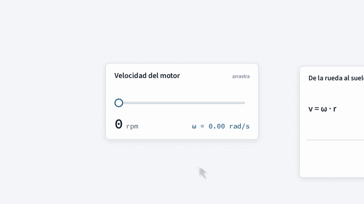

# Trayectoria · From physics to the robot

> **The product is in Spanish.** This page is a short English summary; the full README is [`README.md`](README.md).

Trayectoria is an open source web platform where engineering students learn mathematics, physics and mechanics by manipulating each concept. Every topic ends applied to a robot they can simulate and, if they want, build.

## **[Open it at trayectoria.org →](https://trayectoria.org)**

## Who it is for

- **First-year engineering students** (mechatronics, electrical, mechanical, systems) taking the core courses without seeing what they are for.
- **Line-follower teams** who want to understand their robot, from the encoder to the PID, and try it in the simulator before the track.
- **Teachers** who want to teach with something hands-on, with a digital twin of the lab robot on the platform.

## What v1.0.0 includes

- Two chained learning paths: **Fundamentals** (physics and mathematics for robots, 14 topics in 4 modules) and **Mobile robot** (from the encoder to the track, 11 topics in 3 modules).
- A 2D mobile robot simulator (differential drive, line sensors, on/off, P and PID controllers) and a 3D arm simulator, running in the browser.
- A "My robot" profile and a minimal classroom mode.

## What it is not

Not an LMS, not a competitor to Gazebo, Isaac Sim or CoppeliaSim, not a CAD, and not a replacement for the teacher.

## License and contact

Code under MIT ([`LICENSE`](LICENSE)), content under CC BY-SA 4.0 ([`LICENSE-CONTENT`](LICENSE-CONTENT)). Contact: `contacto@trayectoria.org`.
